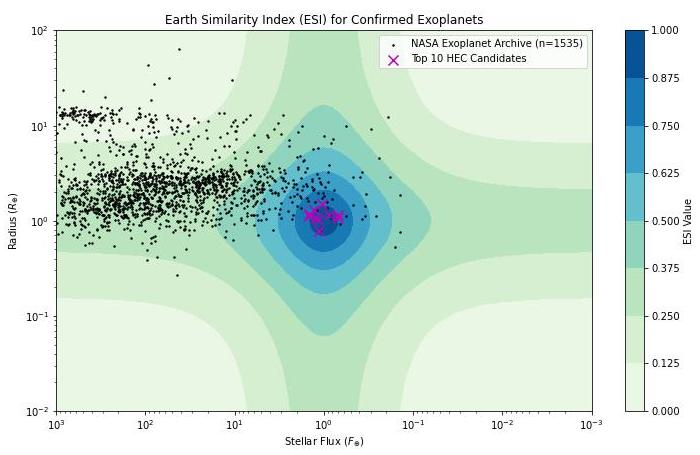

# Exoplanet Data Analysis

An exploration of exoplanet data provided by NASA and the Planetary Habitability Library (PHL) at the University of Puerto Rico.

Made with matplotlib, numpy, and Pandas.

Figures:

